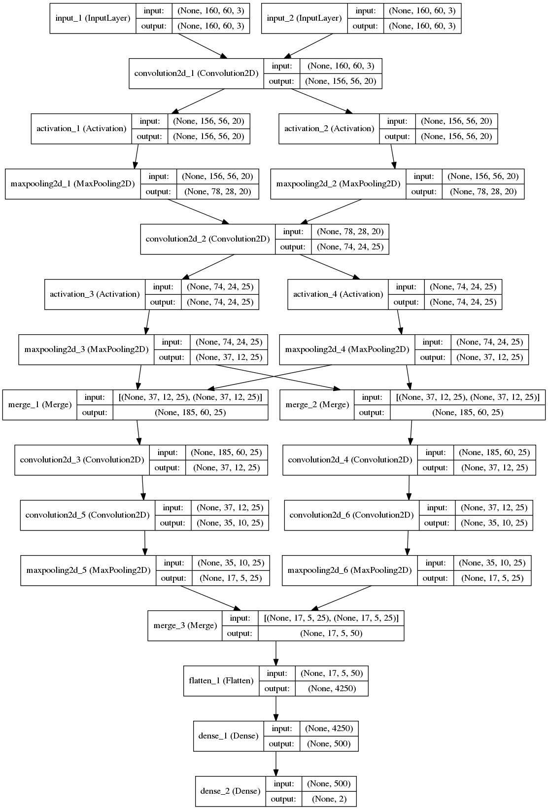

# CVPR 2015 CNN for Person Re-Identification (PyTorch Refactoring)
# CVPR 2015 人员重识别CNN (PyTorch 重构版)

[](https://www.python.org/downloads/)
[](https://pytorch.org/)
[](https://opensource.org/licenses/MIT)

> 🎓 **Educational Refactoring** | 教学导向重构
> A modern PyTorch implementation of the CVPR 2015 paper with comprehensive tutorials and documentation.
> 使用现代 PyTorch 框架实现 CVPR 2015 论文，包含完整教程和文档。

---

## 📖 About | 关于项目

This project is a **complete refactoring** of the classic Person Re-Identification (ReID) algorithm from the CVPR 2015 paper:

本项目是经典人员重识别算法的**完全重构**，基于 CVPR 2015 论文：

> **"An Improved Deep Learning Architecture for Person Re-Identification"**
> by Ejaz Ahmed, Michael Jones, and Tim K. Marks

**Paper**: [CVPR 2015 PDF](http://www.cv-foundation.org/openaccess/content_cvpr_2015/papers/Ahmed_An_Improved_Deep_2015_CVPR_paper.pdf)

### 🎯 Project Goals | 项目目标

- ✅ **Modern Tech Stack**: Migrate from TensorFlow 1.x to PyTorch 2.5+ / 使用 PyTorch 2.5+ 替代 TensorFlow 1.x
- ✅ **Educational Focus**: Comprehensive Jupyter notebooks and bilingual docs / 完整教学笔记本和中英文档
- ✅ **Best Practices**: PyTorch Lightning, Type Hints, Modular Design / Lightning 框架、类型提示、模块化设计
- ✅ **Reproducibility**: uv package manager, YAML configs / uv 包管理、YAML 配置

---

## 🚀 Quick Start | 快速开始

### Installation | 安装

```bash
# Clone repository | 克隆仓库
git clone https://github.com/Ning-Ding/Implementation-CVPR2015-CNN-for-ReID.git
cd Implementation-CVPR2015-CNN-for-ReID

# Install dependencies with uv | 使用 uv 安装依赖
uv sync --all-extras

# Activate virtual environment | 激活虚拟环境
source .venv/bin/activate  # Linux/Mac
# or
.venv\\Scripts\\activate  # Windows
```

### Training | 训练

```bash
# Train on CUHK03 dataset | 在 CUHK03 数据集上训练
python scripts/train.py --config config/cuhk03.yaml

# Train on Market-1501 dataset | 在 Market-1501 数据集上训练
python scripts/train.py --config config/market1501.yaml
```

### Using Jupyter Notebooks | 使用 Jupyter 笔记本

```bash
jupyter lab

# Open notebooks in order:
# 1. notebooks/01_introduction.ipynb
# 2. notebooks/02_data_exploration.ipynb
# 3. notebooks/03_model_architecture.ipynb
# 4. notebooks/04_training_demo.ipynb
# 5. notebooks/05_evaluation.ipynb
# 6. notebooks/06_inference_demo.ipynb
```

---

## 📂 Project Structure | 项目结构

```
Implementation-CVPR2015-CNN-for-ReID/
├── src/                     # 核心代码 | Core Code
│   ├── data/               # 数据集和数据增强 | Datasets & Augmentation
│   │   ├── base_dataset.py
│   │   ├── cuhk03_dataset.py
│   │   ├── market1501_dataset.py
│   │   └── transforms.py
│   ├── models/             # 模型定义 | Model Definitions
│   │   ├── layers.py       # 自定义层 (Cross-Input) | Custom Layers
│   │   ├── siamese_cnn.py  # 原始论文架构 | Original Architecture
│   │   └── lightning_module.py
│   ├── training/           # 训练逻辑 | Training Logic
│   ├── evaluation/         # 评估指标 (CMC, mAP) | Metrics
│   └── utils/              # 工具函数 | Utilities
│
├── config/                  # YAML 配置文件 | Config Files
│   ├── base.yaml
│   ├── cuhk03.yaml
│   └── market1501.yaml
│
├── notebooks/               # 📓 Jupyter 教学笔记本 | Tutorials
│   ├── 01_introduction.ipynb
│   ├── 02_data_exploration.ipynb
│   ├── 03_model_architecture.ipynb
│   ├── 04_training_demo.ipynb
│   ├── 05_evaluation.ipynb
│   └── 06_inference_demo.ipynb
│
├── docs/                    # 📚 技术文档 | Documentation
│   ├── paper_theory.md     # 论文原理详解
│   ├── architecture.md     # 网络架构详解
│   └── algorithm_explanation.md
│
├── scripts/                 # 可执行脚本 | Executable Scripts
│   ├── train.py
│   └── evaluate.py
│
├── legacy/                  # 旧代码参考 | Legacy Code
│   ├── CUHK03/main.py
│   └── market1501/
│
├── pyproject.toml           # uv 项目配置 | Project Config
└── README.md                # 本文件 | This File
```

---

## 🧠 Model Architecture | 模型架构

The Siamese CNN consists of:
孪生 CNN 网络包含：

1. **Tied Convolution Layers** (权重共享卷积层)
   - Conv1: 20 filters @ 5×5 → MaxPool 2×2
   - Conv2: 25 filters @ 5×5 → MaxPool 2×2

2. **Cross-Input Neighborhood Differences** (交叉输入邻域差异) 🌟
   - Paper's core innovation | 论文核心创新
   - Captures local spatial relationships between image pairs
   - 捕获图像对之间的局部空间关系

3. **Patch Summary Features** (图块摘要特征)
   - Conv 5×5 with stride=5

4. **Across-Patch Features** (跨图块特征)
   - Conv 3×3 → MaxPool 2×2

5. **Fully Connected Layers** (全连接层)
   - FC1: 4250 → 500 (with ReLU)
   - FC2: 500 → 2 (same/different person)



---

## 📊 Supported Datasets | 支持的数据集

### CUHK03
- **Identities**: 1,467 (1,360 labeled + 107 detected)
- **Images**: ~14,000
- **Cameras**: 5 pairs
- **Download**: [CUHK03 Official](http://www.ee.cuhk.edu.hk/~xgwang/CUHK_identification.html)

### Market-1501
- **Identities**: 1,501
- **Images**: 32,668 (12,936 train + 19,732 gallery/query)
- **Cameras**: 6
- **Download**: [Market-1501 Dataset](http://zheng-lab.cecs.anu.edu.au/Project/project_reid.html)

---

## 🛠️ Technology Stack | 技术栈

| Component | Technology |
|-----------|-----------|
| **Deep Learning** | PyTorch 2.5+, PyTorch Lightning 2.4+ |
| **Data Processing** | NumPy 2.0+, Albumentations 2.0+ |
| **Package Manager** | uv (modern pip replacement) |
| **Configuration** | YAML, OmegaConf |
| **Logging** | TensorBoard, Weights & Biases (optional) |
| **Visualization** | Matplotlib, Seaborn, Plotly |
| **Code Quality** | Black, Ruff, MyPy, Pytest |

---

## 📈 Training Configuration | 训练配置

### Hyperparameters (CUHK03) | 超参数

```yaml
model:
  input_size: [160, 60]

loss:
  type: contrastive
  margin: 2.0

optimizer:
  name: sgd
  lr: 0.01
  momentum: 0.9
  weight_decay: 0.00025

scheduler:
  name: polynomial
  power: 0.75

training:
  max_epochs: 2000
  batch_size: 150
```

### Loss Functions | 损失函数

- ✅ **Cross Entropy**: Binary classification (same/different)
- ✅ **Contrastive Loss**: Siamese networks (recommended)
- ✅ **Triplet Loss**: Margin-based learning

---

## 📝 Evaluation Metrics | 评估指标

| Metric | Description | 说明 |
|--------|-------------|------|
| **CMC** | Cumulative Matching Characteristic | 累积匹配特征曲线 |
| **mAP** | mean Average Precision | 平均精度均值 |
| **Rank-1** | Top-1 accuracy | Top-1 准确率 |
| **Rank-5/10/20** | Top-K accuracy | Top-K 准确率 |

Example Results on CUHK03:
```
Rank-1:  ~62%
Rank-5:  ~84%
Rank-10: ~91%
mAP:     ~60%
```

---

## 🔬 Key Features | 核心特性

### From Legacy Code | 相比旧代码
- ❌ TensorFlow 1.x → ✅ PyTorch 2.5+
- ❌ Python 2 syntax → ✅ Python 3.11+ with Type Hints
- ❌ Hardcoded paths → ✅ YAML configuration
- ❌ No tests → ✅ Pytest test suite
- ❌ Scattered code → ✅ Modular design

### Modern Enhancements | 现代化改进
- ✅ PyTorch Lightning (简化训练流程)
- ✅ Albumentations (高性能数据增强)
- ✅ uv package manager (快速依赖管理)
- ✅ Rich logging (美观的终端输出)
- ✅ Type hints (类型安全)
- ✅ Comprehensive documentation (完整文档)

---

## 📚 Learning Resources | 学习资源

### Jupyter Notebooks (Bilingual) | 双语教学笔记本

1. **Introduction** - ReID 问题背景与应用场景
2. **Data Exploration** - 数据集统计分析和可视化
3. **Model Architecture** - 网络结构逐层讲解（含公式推导）
4. **Training Demo** - 训练流程演示与监控
5. **Evaluation** - CMC/mAP 指标详解
6. **Inference** - 模型部署与推理优化

### Documentation | 文档

- [Paper Theory (论文原理)](docs/paper_theory.md)
- [Architecture Details (架构详解)](docs/architecture.md)
- [Algorithm Explanation (算法讲解)](docs/algorithm_explanation.md)

---

## 🤝 Contributing | 贡献指南

Contributions are welcome! Please:

1. Fork the repository
2. Create a feature branch
3. Follow code style (Black + Ruff)
4. Add tests for new features
5. Submit a pull request

---

## 📄 License | 许可证

This project is licensed under the **MIT License** - see the [LICENSE](LICENSE) file for details.

Original implementation by [Ning Ding](https://github.com/Ning-Ding) (2017)
Refactored with modern frameworks (2024)

---

## 🙏 Acknowledgments | 致谢

- Original paper authors: Ejaz Ahmed, Michael Jones, Tim K. Marks
- Original TensorFlow implementation: [Ning Ding](https://github.com/Ning-Ding)
- CUHK03 dataset creators
- Market-1501 dataset creators

---

## 📧 Contact | 联系方式

For questions or discussions:
如有问题或讨论：

- Open an issue on GitHub
- Original author: dingning@sjtu.edu.cn

---

## 🌟 Star History

If you find this project helpful, please consider giving it a star ⭐!

如果这个项目对你有帮助，请给个星标支持！

---

**Last Updated**: 2024
**Status**: ✅ Active Development
